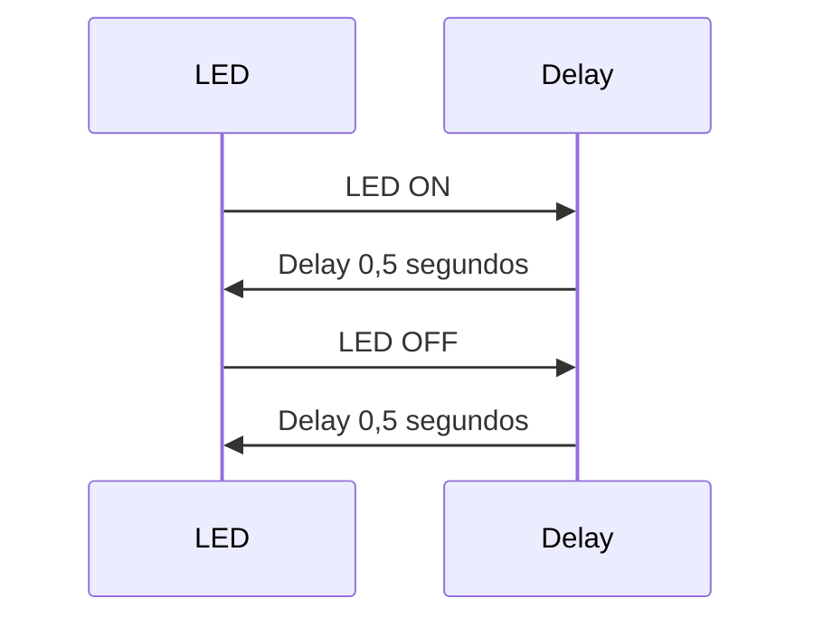
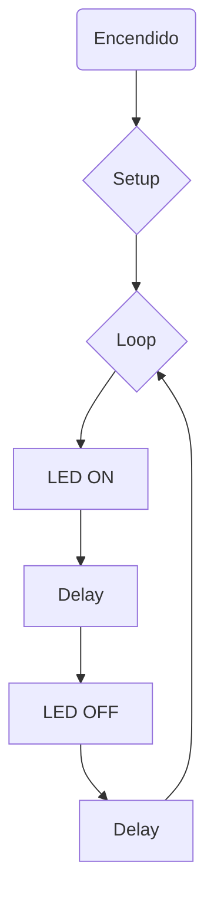

 ## INFORME PRACTICA: MARTI DOMINGUEZ RIVERO
 ### Processadors Digitals Grup 13
 ### Fecha: 20/02/2024

# Practica 1: Blink

 ### Pregunta 2:
 ```cpp
#include <Arduino.h>
#define LED_BUILTIN 23
#define DELAY 1000

void setup() {
    pinMode (LED_BUILTIN, OUTPUT);
    Serial.begin(115200);
}

void loop () {
    
    digitalWrite(LED_BUILTIN, HIGH);
    Serial.println("ON");
    delay(DELAY);
    digitalWrite(LED_BUILTIN, LOW);
    Serial.println("OFF");
    delay(DELAY);
}
```

### Pregunta 3:
```cpp
#include <Arduino.h>
#define LED_BUILTIN 23
#define DELAY 1000
uint32_t *gpio_out = (uint32_t *)GPIO_OUT_REG;

void setup() {
    pinMode (LED_BUILTIN, OUTPUT);
    Serial.begin(115200);
}

void loop () {
    
    *gpio_out |= (1 << LED_BUILTIN);
    Serial.println("ON");
    delay(DELAY);
    *gpio_out ^= (1 << LED_BUILTIN);
    Serial.println("OFF");
    delay(DELAY);
}
 ```

### Pregunta 4:

Añadimos un delay de 500 microsegundos para evitar el jitter

    - Con el envio por el puerto série del mensaje i utilizando las funciones de Arduino:

 ```cpp
#include <Arduino.h>
#define LED_BUILTIN 23
#define DELAY 1000


void setup() {
    pinMode (LED_BUILTIN, OUTPUT);
    Serial.begin(115200);
}

void loop () {
    
    digitalWrite(LED_BUILTIN, HIGH);
    Serial.println("ON");
    ets_delay_us (500);
    digitalWrite(LED_BUILTIN, LOW);
    Serial.println("OFF");
    ets_delay_us (500);
}

 ```

    - Con el envio por el puerto série y accedirendo directamente a los registros:

 ```cpp
#include <Arduino.h>
#define LED_BUILTIN 23
#define DELAY 1000
uint32_t *gpio_out = (uint32_t *)GPIO_OUT_REG;

void setup() {
    pinMode (LED_BUILTIN, OUTPUT);
    Serial.begin(115200);
}

void loop () {
    
    *gpio_out |= (1 << LED_BUILTIN);
    Serial.println("ON");
    ets_delay_us (500);
    *gpio_out ^= (1 << LED_BUILTIN);
    Serial.println("OFF");
    ets_delay_us (500);
}

 ```

    - Sin el envio por el puerto série del mensaje i utilizando las funciones de Arduino:

 ```cpp
#include <Arduino.h>
#define LED_BUILTIN 23
#define DELAY 1000


void setup() {
    pinMode (LED_BUILTIN, OUTPUT);
    Serial.begin(115200);
}

void loop () {
    
    digitalWrite(LED_BUILTIN, HIGH);
    ets_delay_us (500);
    digitalWrite(LED_BUILTIN, LOW);
    ets_delay_us (500);
}

 ```

- Sin el envio por el puerto série y accedirendo directamente a los registros:


    
 ```cpp
#include <Arduino.h>
#define LED_BUILTIN 23
#define DELAY 1000
uint32_t *gpio_out = (uint32_t *)GPIO_OUT_REG;


void setup() {
    pinMode (LED_BUILTIN, OUTPUT);
    Serial.begin(115200);
}

void loop () {
    
    *gpio_out |= (1 << LED_BUILTIN);
    ets_delay_us (500);
    *gpio_out ^= (1 << LED_BUILTIN);
    ets_delay_us (500);
}

 ```
### Pregunta 5: 

### Diagrama de tiempo



### Diagrama de flujo




